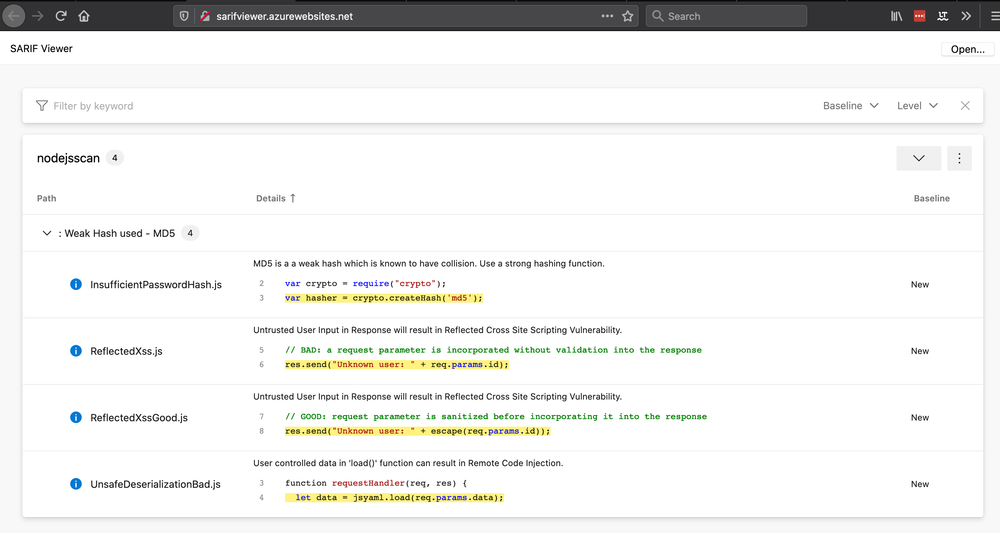
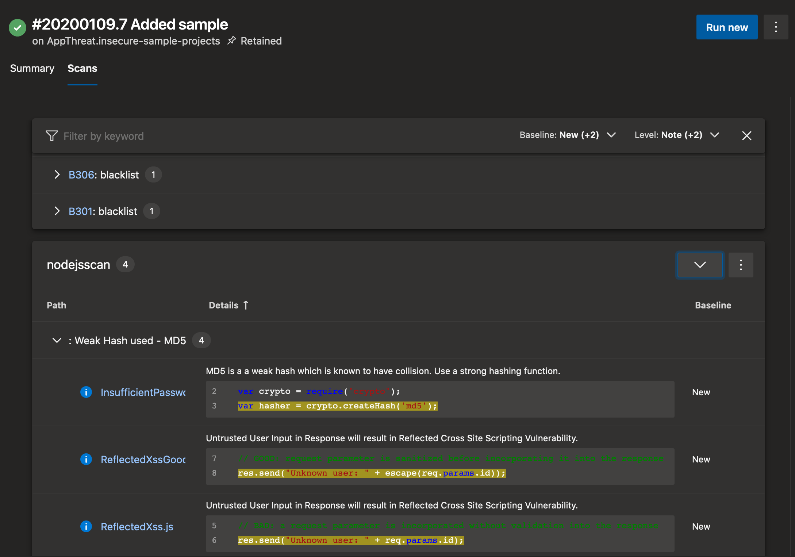
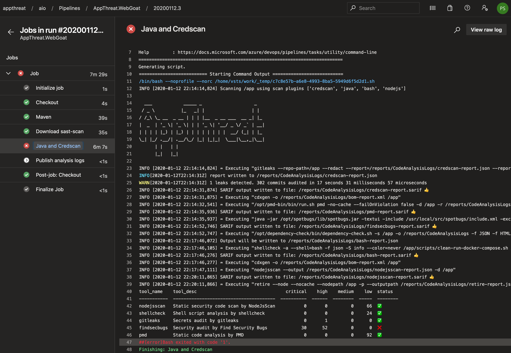

# Introduction

```bash
  ___            _____ _                    _
 / _ \          |_   _| |                  | |
/ /_\ \_ __  _ __ | | | |__  _ __ ___  __ _| |_
|  _  | '_ \| '_ \| | | '_ \| '__/ _ \/ _` | __|
| | | | |_) | |_) | | | | | | | |  __/ (_| | |_
\_| |_/ .__/| .__/\_/ |_| |_|_|  \___|\__,_|\__|
      | |   | |
      |_|   |_|
```

This repo builds `appthreat/sast-scan` (and `quay.io/appthreat/sast-scan`), a container image with a number of bundled open-source static analysis security testing (SAST) tools. This is like a Swiss Army knife for DevSecOps engineers.

[](https://quay.io/repository/appthreat/sast-scan)

## Features

- No messy configuration and no server required.
- Scanning is performed directly in the CI and is extremely quick. Full scan often takes only couple of mins
- Automatic exit code 1 (build breaker) with critical and high vulnerabilities

## Bundled tools

| Programming Language | Tools                              |
| -------------------- | ---------------------------------- |
| ansible              | ansible-lint                       |
| aws                  | cfn-lint, cfn_nag                  |
| bash                 | shellcheck                         |
| bom                  | cdxgen                             |
| credscan             | gitleaks                           |
| depscan              | dep-scan                           |
| golang               | gosec, staticcheck                 |
| java                 | cdxgen, gradle, find-sec-bugs, pmd |
| json                 | jq, jsondiff, jsonschema           |
| kotlin               | detekt                             |
| kubernetes           | kube-score                         |
| nodejs               | cdxgen, NodeJsScan, eslint, yarn   |
| puppet               | puppet-lint                        |
| python               | bandit, cdxgen, pipenv             |
| ruby                 | railroader, cyclonedx-ruby         |
| rust                 | cargo-audit                        |
| terraform            | tfsec                              |
| yaml                 | yamllint                           |

## Bundled languages/runtime

- jq
- Golang 1.12
- Python 3.6
- OpenJDK 11 (jre)
- Ruby 2.5.5
- Rust
- Node.js 10
- Yarnpkg

Some reports get converted into an open-standard called [SARIF](https://sarifweb.azurewebsites.net/). Please see the section on `Viewing reports` for various viewer options for this.

### Tools enabled for SARIF conversion

- Bash - shellcheck
- Credscan - gitleaks
- Python - bandit
- Node.js - NodeJsScan
- Java - pmd, find-sec-bugs
- Golang - gosec
- Terraform - tfsec

## Usage

sast-scan is ideal for use with CI and also as a pre-commit hook for local development.

## Integration with Azure DevOps

Refer to the [document](docs/azure-devops.md)

## Integration with GitHub action

This tool can be used with GitHub actions using this [action](https://github.com/marketplace/actions/sast-scan). All the supported languages can be used.

This repo self-tests itself with sast-scan! Check the GitHub [workflow file](https://github.com/AppThreat/sast-scan/blob/master/.github/workflows/pythonapp.yml) of this repo.

```yaml
- name: Self sast-scan
  uses: AppThreat/sast-scan-action@v1.0.0
  with:
    output: reports
    type: python,bash
- name: Upload scan reports
  uses: actions/upload-artifact@v1.0.0
  with:
    name: sast-scan-reports
    path: reports
```

## Integration with Google CloudBuild

Use this [custom builder](https://github.com/CloudBuildr/google-custom-builders/tree/master/sast-scan) to add sast-scan as a build step.

The full steps are reproduced below.

1. Add the custom builder to your project

```bash
git clone https://github.com/CloudBuildr/google-custom-builders.git
cd google-custom-builders/sast-scan
gcloud builds submit --config cloudbuild.yaml .
```

2. Use it in cloudbuild.yaml

```yaml
steps:
  - name: "gcr.io/$PROJECT_ID/sast-scan"
    args: ["--type", "python"]
```

## Integration with CircleCI

Refer to the [document](docs/circleci.md)

## Custom integration

SARIF reports produced by sast-scan can be integrated with other compatible tools. It can also be easily imported into databases such as BigQuery for visualization purposes. Refer to [integration](docs/integration.md) document for detailed explanation on the SARIF format.

### Scanning projects locally

Scan python project

```bash
docker run --rm --tmpfs /tmp -v <source path>:/app appthreat/sast-scan scan --src /app --type python --out_dir /app/reports
```

Scan multiple projects

```bash
docker run --rm --tmpfs /tmp -v <source path>:/app appthreat/sast-scan scan --src /app --type credscan,nodejs,python,yaml --out_dir /app/reports
```

Scan java project

For java and jvm language based projects, it is important to mount the volumes containing .m2 or .gradle directories. It is therefore necessary to compile the projects before invoking sast-scan in the dev and CI workflow.

```bash
docker run --rm --tmpfs /tmp -v ~/.m2:/.m2 -v <source path>:/app appthreat/sast-scan scan --src /app --type java --out_dir /app/reports

# For gradle project
docker run --rm --tmpfs /tmp -v ~/.gradle:/.gradle -v <source path>:/app appthreat/sast-scan scan --src /app --type java --out_dir /app/reports
```

**Automatic project detection**

Feel free to skip `--type` to enable auto-detection. Or pass comma-separated values if the project has multiple types.

### Invoking built-in tools

Bandit

```bash
docker run --rm -v <source path>:/app appthreat/sast-scan bandit -r /app
```

## Viewing reports

Reports would be produced in the directory specified for `--out_dir`. In the above examples, it is set to `reports` which will be a directory under the source code root directory.

Some of the reports would be converted to a standard called [SARIF](https://sarifweb.azurewebsites.net/). Such reports would end with the extension `.sarif`. To open and view the sarif files require a viewer such as:

- Online viewer - http://sarifviewer.azurewebsites.net/
- VS Code extension - https://marketplace.visualstudio.com/items?itemName=MS-SarifVSCode.sarif-viewer
- Visual Studio extension - https://marketplace.visualstudio.com/items?itemName=WDGIS.MicrosoftSarifViewer
- Azure DevOps extension - https://marketplace.visualstudio.com/items?itemName=sariftools.sarif-viewer-build-tab

**Example reports:**

Online viewer can be used to manually upload the .sarif files as shown.



Azure DevOps SARIF plugin can be integrated to show the analysis integrated with the build run as shown.





## Alternatives

GitLab [SAST](https://docs.gitlab.com/ee/user/application_security/sast/) uses numerous single purpose [analyzers](https://gitlab.com/gitlab-org/security-products/analyzers) and Go based converters to produce a custom json format. This model has the downside of increasing build times since multiple container images should get downloaded and hence is not suitable for CI environments such as Azure Pipelines, CodeBuild and Google CloudBuild. Plus the license used by GitLab is not opensource even though the analyzers merely wrap existing oss tools!

MIR [SWAMP](https://www.mir-swamp.org/) is a free online service for running both oss and commercial static analysis for a number of languages simillar to sast-scan. There is a free SWAMP-in-a-box offering but the setup is a bit cumbersome. They use a xml format called SCARF with a number of perl based converters. SARIF, in contrast, is json based and is much easier to work with for integration and UI purposes. By adopting python, sast-scan is a bit easy to work with for customisation.
